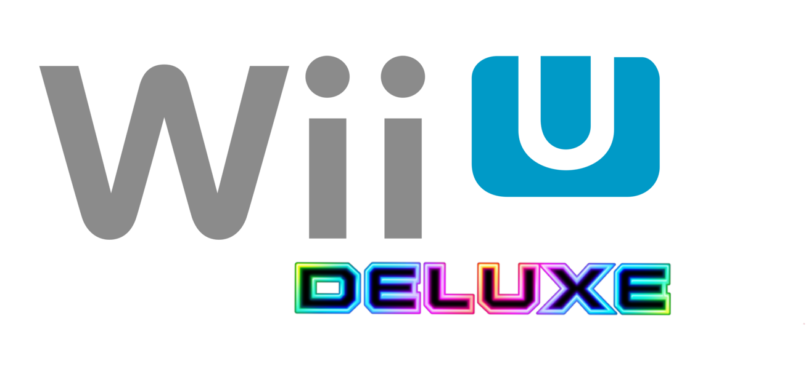

> [!WARNING]
> **This branch is experimental and can be unstable. This is the rewrite in Python of the original C# project.**

	
	<h1 align="center">Wii U Cafe SDK Deluxe</h1>
	
Wii U Cafe SDK Deluxe is a tool to facilitate the creation of an installable image of a Unity game on a retail Wii U and not a CAT-DEV or CAT-R which are official development kits.

	
To use this tool, you need several things: A Retail Wii U, Unity For Wii U and the Cafe SDK.

When you publish or release a Wii U Game made using Wii U Café SDK Deluxe, you're free to open an issue with the game release tag to let us see games that were made ! (it is not mandatory but nice to see your creations)

