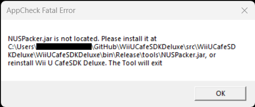

	<h1 align="center">This "tools" folder</h1>
	
This folder is here if you have trouble with the toolspack inside Wii U Cafe SDK Deluxe. If you have one of this message (not for missing Python/Java exe)

If you have this message, please download the WiiUCafeSDKDeluxe_Tools.zip and place the folder 'tools' inside the same folder as 'WiiUCafeSDKDeluxe.exe'. The app will normaly recognize the tools, if not please open an issue

Note : If the file 'keygen.py' is missing. Please just download if from this folder and place it inside the same folder as 'WiiUCafeSDKDeluxe.exe'

